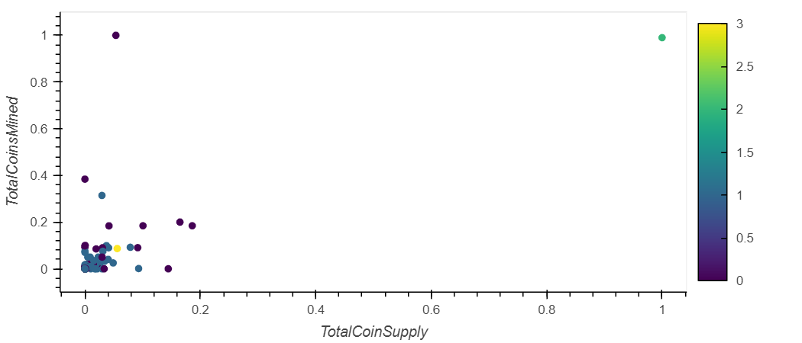

# KMeans Classification of Cryptocurrencies

Using Unsupervised Machine Learning methods to classify cyptocurrencies based coin supply, coins mined and algorithm types

Methods
---

Using Pandas, I import and clean up a csv file containing cryptocurrencies data, removing any rows with null values.

Because I want to classify these currencies by some variables still represented in text, I use Pandas' get_dummies() method on the dataframe producing a new frame with shape (532, 98).

KMeans works best in low-dimensionality datasets, so a 98 variable frame will have to be reduced with scikit-learn's PCA. PCA also requires standardization of data as it uses standard deviations to weight variables.

After running PCA and reducing the dimensionality of the dataset to 3 principle components, I fit a KMeans model on the new dataframe iterating over a range of 1 through 10 centroids to classify. For Each of these models, I add a point for the inertia value to a graph where the x axis is the number of centroids and the y axis is the inertia. This produces an Elbow Graph.

With an inflection point at 4, I use the KMeans model with 4 centroids to produce a classification array and append it to the end of my dataframe.

Results
---

<a href="">3D plotly</a> scatter plot with colors representing KMeans clusters.
<figure>
    
    <figcaption align="center">Cross-section showing points on Principle Components 1 & 2.</figcaption>
</figure>

Concetating the original, unstandardized CoinSupply and CoinsMined data with the KMeans cluster class data I create a new dataframe. Next, I fit a MinMax scaler to the data so that it would be easier to fit in a scatter plot.

<figure>
    
    <figcaption align="center">hvplot of Crypto Currency Supply vs Mined Coins with Color Applied According to KMeans Class.</figcaption>
</figure>